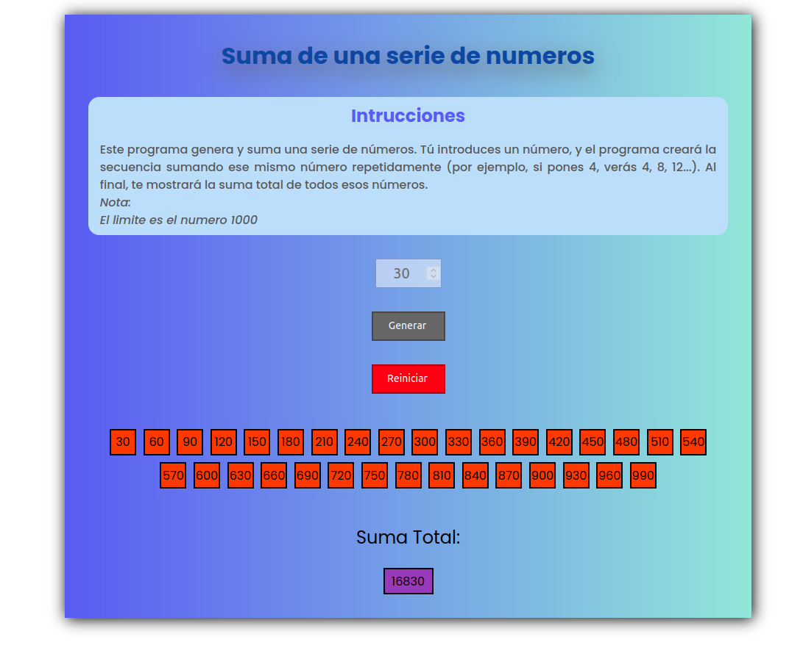

# Suma de una serie de numeros
*Create by: Alfredo Jiménez*
*Languajes: HTML,CSS y Javascript*

## Objetivo

Diseñar un algoritmo que visualice y sume la serie de números 3, 6, 9, 12..., 99.

Funcionalidades de la implementacion

- La funcion realizarSerie(); realiza una serie de validaciones, donde si el digito del campo de entrada sea un numero, si el valor del campo de entrada es menor o igual que cero o es mayor a 100, sale un aviso y se limpia el campo, para salir de este aviso se debe dar clic en el boton reiniciar para reiniciar el algoritmo.
- Cuando el algoritmo se ejecuta correctamente, se muestra la serie de numeros con el numero validado, ademas de mostrar la suma de toda la serie.
- Se le coloco un listener al boton enter para que ejecute la funcion "realizarSerie();".

<figure>
  
  <figcaption>Figura1. Implementación del problema en una página Web</figcaption>
</figure>
