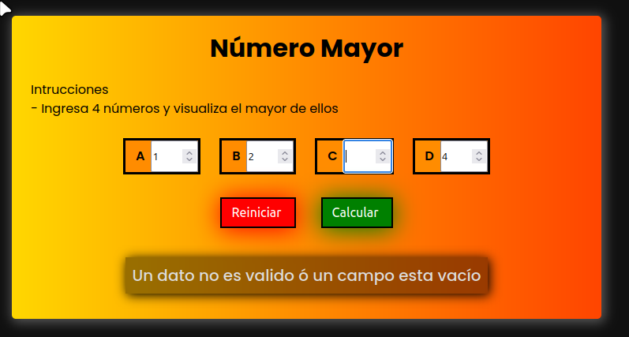

# Ejercicio: Mayor de 4 números

*Create by: Alfredo Jimenez*
*Languajes: HTML,CSS, Javascript*/

## Objetivo
Escribir un algoritmo que lea cuatro números y a continuación visualice el mayor de los cuatro.

## Capturas de pantalla

- La funcion procesarNumeros() realiza dos validaciones, si algun campo esta vacio notifica al usuario o que el campo contenga un dato que no sea numero, vacia el campo y te permite ingresar un numero en lugar del dato erroneo sin borrar los demas campos correctos, la tercera validacion realiza una revision de si el usuario presiona el boton generar con los campos vacios, al hacer este error te sale una notificacion de que tus campos estan vacios.
- Se puede resetear todos los campos con la funcion reiniciar(); reinicia todo el algoritmo para volver a ingresar nuevos numeros y un nuevo resultado

### Campo con error o campo vacio

<figure>
    
    <figcaption><em>Figura 1. Campo error</em></figcaption>
</figure>

### Todos los campos vacios

<figure>
    
    <figcaption><em>Figura 1. Visualizacion cuando los campos estan vacios</em></figcaption>
</figure>
### Programa funcionando

<figure>
    
    <figcaption><em>Figura 1. Algoritmo Implementado</em></figcaption>
</figure>
